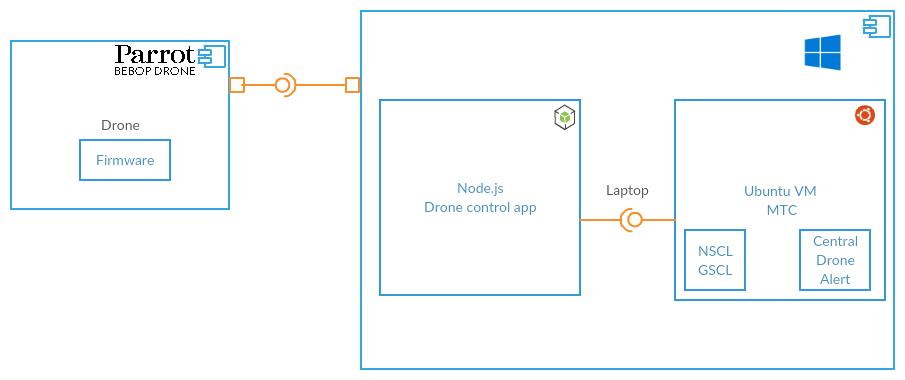

    

    

## How To View:

### Demo: [StartDroneApp](https://StartDroneApp.herokuapp.com)

### Video Demo

<video width="320" height="240" controls>
  <source src="docs/StartDroneApp.mp4" type="video/mp4">
</video>

## Installation

The web application can work without being connected to the Drone or MTC server as long as the checkboxes are not ticked, therefore their setup is optional.

### Setup Overview (Component Diagram)

    

### Requirements:

#### Web Application (Mandatory):

- [Meteor](https://www.meteor.com/install) which usually comes with Node.js.

- If it doesn't come with it, download [Node.js](https://nodejs.org/en/download/) separately(LTS version should be ok).

#### Drone (Optional):
- This was developed to work with a [Parrot Bebop 2](https://www.parrot.com/us/drones/parrot-bebop-2/) drone.

For the Drone to work with Python libraries:
- [Anaconda](https://conda.io/docs/user-guide/install/index.html) that usually comes with Python.	

- If it doesn't come with it, install the latest version of [Python 2.7](https://www.python.org/downloads/) separately.

#### MTC Server (Optional):
This has to be ideally set up on a Linux distribution to install it's OpenMTC implementation:

- I used [Ubuntu 14.04 LTS Desktop](https://www.ubuntu.com/#download)
- Install the [OpenMTC](https://www.openmtc.org/doc.html#installationoftheopenmtcsdk) on it.

### Running the Web Application:

Finally,

Clone this repository:

    $ git clone https://github.com/nicbuitr/StartDroneApp.git

Run:

    $ meteor npm install

This will install NPM packages and update the Meteor packages used in the project.

To initialize the app run:

    $ meteor

Once its deployed go to http://localhost:3000/

1. Set up Web App's parameters as desired or leave them as default.
2. Leave the Drone and MTC checkboxes unticked.
3. Hit the "Start Drone" button.
4. Enjoy the show.

#### Using the Drone:

To make the app work with the Drone:

1. Turn the Drone ON.
2. Connect to Drone's WiFi, it has to be from the device where Node.js server is running, as the interactions happens between Drone <-> Meteor's Node.js server.
3. Place it somewhere safe for it to take off.
4. Set up Web App's parameters as desired or leave them as default.
5. Tick "Drone Connected to Server?" checkbox.
6. Stand at a safe distance.
7. Hit the "Start Drone" button.
8. Enjoy the show and wait patiently until it is finished.

### Using the MTC:

Once the OpenMTC is installed on the server do the following:
1. Copy the "SmartIMZSeeking" folder located in this repo under "MTC" folder.
2. Paste it at the "apps" folder of the OpenMTC directory e.g: "/home/openmtc/openmtc-ula/apps".
3. Make sure both NSCL and GSCL are working properly by doing the following:
    1. Open 2 terminals and go to "openmtc-ula/openmtc-gevent" and run both (NSCL always first):
	
           $ cd openmtc-ula/openmtc-gevent
           $ sudo ./run_nscl
           $ sudo ./run_gscl

    2. NSCL should initialize correctly.
    3. GSCL too and NSCL should detect it and register on its terminal.

To make it work with the MTC:
1. Turn ON both NSCL and GSCL following the steps above.
2. Open 3 additional terminals and go to app directory:

       $ cd openmtc-ula/apps/SmartIMZSeeking/

3. On 1st terminal:

       $ sudo python ./1_ZoneAlert.py

4. On 2nd terminal:

       $ sudo python ./2_Central.py

5. On 3rd terminal:

       $ sudo python ./3_DroneSensor.py

6. Set up Web App's parameters as desired or leave them as default.
7. Update the IP at "MTC Container URL" to the one of your MTC server(Use ifconfig on terminal if on doubt), folders and port should be the same.
8. Tick "MTC & Scripts Running?" checkbox.
9. Stand at a safe distance if using along with drone.
10. Hit the "Start Drone" button.
11. Keep an eye on the terminals to see the posts to MTC.
12. Enjoy the show and wait patiently until it is finished.

## Built with:

 |   |     |  |  | 
:---:|:---:|:---:|:---:|:---:|:---:
  |  |  |  | 

## License

MIT © [Nicolás Buitrago Castaño](https://github.com/nicbuitr)

